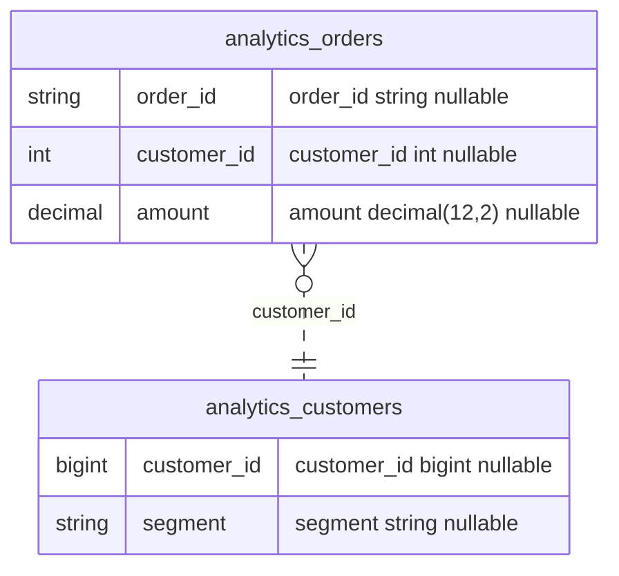

# TableDossier

**Portable data profiling, notebooks, and documentation.**

TableDossier turns exploratory profiling into a structured, reproducible *dossier* for each table:
structure, measurements, observed formats, quality signals, limitations and known relationships.
You generate a profiling notebook **on your own computer, without any connection to the data**,
run it **inside Databricks** with the permissions you already have there, and reuse the exported
profile **offline** as the single source for a data dictionary, a data quality report (DQR) and an ER diagram.

> Status: early release (0.3.0). The notebook runtime has been executed against local Spark 3.5 and
> 4.0, in classic mode and through a local Spark Connect server, with synthetic data; **it has not yet been
> validated on a Databricks workspace** — see [Compatibility](#11-compatibility-and-troubleshooting).
> Português: [visão geral](docs/pt-BR/overview.md) e [quickstart](docs/pt-BR/quickstart.md).

## 1. The problem

Documenting tables usually means one of two things: a notebook of ad-hoc queries that nobody can
reuse, or a platform that needs credentials, connectors and a server. TableDossier sits in between:

- the **generator** is a small offline CLI (no Spark, no drivers, no cloud SDK, no network);
- the **notebook** is self-contained and reads your tables where they live;
- the **profile** (`profile.json`) is a versioned, validated contract from which every document is rendered.

Nothing is inferred beyond the evidence: approximate counts say they are approximate, samples say they
are samples, business meaning stays unknown unless a source comment or a person states it.

## 2. How it works

```text
YOUR COMPUTER (offline)                  DATABRICKS (your permissions)             YOUR COMPUTER (offline)
tabledossier init / generate  ──import──▶  notebook: widgets → validate →   ──copy──▶  tabledossier validate
  profile.config.json                      metadata, sample, aggregations            tabledossier render
  dist/profile_databricks.py               → results/<run_id>/profile.json …         → docs (+ your annotations)
```

A generated notebook contains **no results**: it has a generation manifest, not metrics. Metrics
exist only after it runs, in a run directory with its own manifest.

## 3. Preview (real output from synthetic data)

These excerpts come from [`examples/demo/output`](examples/demo/output), produced by executing the
generated notebook file on a *local* Spark session over the synthetic tables of
[`examples/demo/create_demo_tables.sql`](examples/demo/create_demo_tables.sql), then re-rendering with
[`annotations.json`](examples/demo/annotations.json). The profile honestly records
`execution_context: spark`, not Databricks.

**Data dictionary** ([full file](examples/demo/output/annotated/data_dictionary.md)):

| Field | Type | Declared nullable | Description | Nulls | Distinct | Observed format | Candidate roles |
| --- | --- | --- | --- | --- | --- | --- | --- |
| `customer_id` | `bigint` | yes | Surrogate key of the customer. _(annotation)_<br>Synthetic surrogate key _(source comment)_ | 0 (0.00%) | ≈ 499 | — | identifier candidate |
| `email` | `string` | yes | _Unknown — no description in the source or in annotations._ | 47 (9.40%) | ≈ 465 | `email_candidate` (sample, 100.00% of 453) | — |
| `middle_name` | `string` | yes | _Unknown — no description in the source or in annotations._ | 500 (100.00%) | ≈ 0 | _insufficient data_ | — |
| `` `a.b` `` | `string` | yes | A column literally named a.b, kept to show path quoting. _(annotation)_ | 0 (0.00%) | ≈ 2 | _unknown_ | categorical candidate |

**Data Quality Report** ([full file](examples/demo/output/annotated/quality_report.md)) — executed checks
are kept apart from heuristic alerts and proposals:

| Table | Check | Target | Type | Parameters | Observed | Status |
| --- | --- | --- | --- | --- | --- | --- |
| analytics.orders | `orders_amount_range` | `amount` | `value_range` | min=0, max=10000 | min 0.38, max 95000.00 | **fail** |
| analytics.returns | `returns_reason_nulls` | `reason` | `max_null_ratio` | max=0.1 | — | **not_evaluated** |

**ER diagram** ([`erd.mmd`](examples/demo/output/annotated/erd.mmd)) — an edge is drawn only because a
person provided its cardinality in [`demo.config.json`](examples/demo/demo.config.json):



**A metric in `profile.json`** ([full file](examples/demo/output/run/profile.json)) states source, scope,
accuracy and denominator:

```json
{
  "name": "null_count_parent_present",
  "status": "measured",
  "value": 0,
  "value_type": "integer",
  "unit": "rows",
  "scope": "filtered_snapshot",
  "accuracy": "exact",
  "source": "aggregate",
  "method": "rows whose parent struct is not null and the field is null",
  "denominator": 880,
  "denominator_unit": "rows"
}
```

**Deep level** ([`examples/demo/output/deep`](examples/demo/output/deep), same notebook with
`analysis_level = deep`): array elements and map entries are measured per element, never per row, and JSON paths are
catalogued from the sample and validated over the full scope when the runtime can:

| Field | Type | Declared nullable | Description | Nulls | Distinct | Observed format | Candidate roles | Notes |
| --- | --- | --- | --- | --- | --- | --- | --- | --- |
| `items[].qty` | `int` | yes | _Unknown — no description in the source or in annotations._ | 500 (16.67% of 3,000 elements) | 5 (sample) | — | — | per element of items |
| `attributes{value}` | `string` | yes | _Unknown — no description in the source or in annotations._ | 700 (40.00% of 1,750 entries) | 177 (sample) | — | — | per entry of attributes |

| Path | Present in (sample) | Types (sample) | Heterogeneous | Full scope (documents) |
| --- | --- | --- | --- | --- |
| `$.amount` | 1,853 (98.09%) | number 1853 | no | non-null 1,853 (97.84%) |
| `$[*]` | 36 (1.91%) | number 108 | no | _not computed_: wildcard or unquotable path; not validated |

**Deep level, part II** (same run, keys and relationships requested in
[`demo.config.json`](examples/demo/demo.config.json)): keys are checked exactly, known relationships against the
data, and hypotheses come from the data only — counts, never values. Three duplicated event ids and five orphan
orders are planted in the synthetic data ([quality report](examples/demo/output/deep/quality_report.md),
[relationships](examples/demo/output/deep/relationships.md)):

| Table | Key | Origin | Outcome | Rows in scope | Rows with NULL in the key | Distinct keys | Duplicate groups | Rows in duplicate groups | Most rows per key | Scope |
| --- | --- | --- | --- | --- | --- | --- | --- | --- | --- | --- |
| analytics.orders | `order_id` | configured, identifier candidate | unique | 1,000 | 0 | 1,000 | 0 | 0 | 1 | filtered rows at a pinned snapshot |
| analytics.order\_events | `event_id` | configured, identifier candidate | **duplicates** | 2,000 | 0 | 1,997 | 3 | 6 | 2 | all rows at a pinned snapshot |

| Relationship | From | To | Mode | Validation | Source rows with a complete key | Source rows with NULL in the key | Orphan rows | Orphan ratio | Target key unique | Versions read |
| --- | --- | --- | --- | --- | --- | --- | --- | --- | --- | --- |
| `orders_customer` | analytics.orders (customer\_id) | analytics.customers (customer\_id) | full scope | **violated** | 1,000 | 0 | 5 | 0.50% | yes | from v1, to v1 |
| `events_order` | analytics.order\_events (order\_id) | analytics.orders (order\_id) | full scope | validated | 2,000 | 0 | 0 | 0.00% | yes | from v0, to v1 |

| Hypothesis | From | To | Inclusion | Included rows | Target key unique | Types | Measured range | Versions read |
| --- | --- | --- | --- | --- | --- | --- | --- | --- |
| `hyp_1` | analytics.customers (referrer\_id) | analytics.customers (customer\_id) | 100.00% (sample) | 50 of 50 | yes | same type kind (integer) | contained (values) | from v1, to v1 |

A hypothesis never becomes an ER edge and has no cardinality: `customers.referrer_id` was found from the data (it
is a planted self-reference), not from its name.
The generated notebook itself is committed at
[`examples/demo/output/notebook/profile_databricks.py`](examples/demo/output/notebook/profile_databricks.py).

## 4. What works today and what is planned

| Capability | Status |
| --- | --- |
| `init`, `validate`, `generate`, `render`, `schema` CLI (offline) | Implemented and tested (Python 3.10–3.14) |
| Self-contained Databricks source notebook (`.py`) with widgets | Implemented; executed locally with Spark 3.5/4.0, classic and Spark Connect; **Databricks validation pending** |
| Levels `metadata` and `standard` | Implemented |
| Level `deep`, part I: array/map element metrics, element distinct counts, JSON path catalogue and full-scope validation, with budgets | Implemented (0.2.0); tested locally with Spark 3.5/4.0, classic and Spark Connect |
| Level `deep`, part II: exact uniqueness of keys, referential validation pinned to the recorded snapshots, data-driven relationship hypotheses, with budgets | Implemented (0.3.0); tested locally with Spark 3.5/4.0, classic and Spark Connect; declared keys and foreign keys tested with a simulated `information_schema` |
| Delta snapshot pinning (`VERSION AS OF`) for every row read | Implemented; tested with local delta-spark 3.3 |
| Profile JSON Schema 1.2 (additive; the CLI still reads 1.0 and 1.1), stdlib + formal validation | Implemented |
| Data dictionary, DQR, relationships, Mermaid ERD, suggested rules | Implemented |
| Human annotations file | Implemented |
| Unity Catalog PK/FK from `information_schema` | Implemented; **not testable locally, validation pending** |
| PostgreSQL connector, remote Databricks execution, `.ipynb`, profile diff | [Roadmap](docs/roadmap.md) — not available |

## 5. Requirements

| Where | Needs | Does **not** need |
| --- | --- | --- |
| Your computer (generator, validator, renderer) | Python ≥ 3.10 and `jsonschema` (installed with the package) | Spark, Java, Docker, database drivers, cloud SDKs, credentials, network after installation |
| Databricks (running the notebook) | A Databricks Runtime with Python and PySpark; read access to the tables; write access to one output directory (a Unity Catalog volume is recommended) | Installing TableDossier, downloading wheels, `%run` of helper notebooks, internet access |

Targets: Databricks Runtime **16.4 LTS** (Spark 3.5.2, Python 3.12) as primary target; **15.4 LTS** (Spark 3.5.0)
and **17.3 LTS** (Spark 4.0.0) as secondary targets. See [compatibility](docs/compatibility.md) for what was
actually tested.

## 6. Quickstart

The package is not published on PyPI. Install the tagged release from GitHub, or from a checkout with
`python -m pip install .` (air-gapped machines: see [offline installation](docs/offline-install.md)).

```bash
python -m venv .venv
# Activate the environment for your OS (e.g. source .venv/bin/activate).
python -m pip install "tabledossier @ git+https://github.com/ruanpato/tabledossier@v0.3.0"

tabledossier init --output profile.config.json
tabledossier validate --config profile.config.json
tabledossier generate --config profile.config.json --output dist/profile_databricks.py
```

`init` writes every option explicitly (documented in [configuration](docs/configuration.md)). The table
list may stay empty: the notebook is generated anyway and asks for tables at run time.

Then, in Databricks:

1. **Import** `dist/profile_databricks.py` (Workspace → your folder → ⋮ → *Import* → *File*). Databricks
   recognizes the `# Databricks notebook source` header and cells.
2. **Attach compute** running a supported runtime (see [compatibility](docs/compatibility.md)).
3. **Optional demo data**: run [`examples/demo/create_demo_tables.sql`](examples/demo/create_demo_tables.sql)
   in a schema you own (it creates four synthetic tables), e.g. in `demo.analytics`.
4. **Fill the widgets** at the top: `tables_json` = `["demo.analytics.orders"]` (your tables or the demo
   ones) and `output_dir` = a directory you can write, e.g. `/Volumes/<catalog>/<schema>/<volume>/tabledossier`.
   Then *Run all*.
5. **Find the results** in `output_dir/<run_id>/`. The last cell prints the exact path and copy commands,
   for example `databricks fs cp -r dbfs:/Volumes/<catalog>/<schema>/<volume>/tabledossier/<run_id> ./downloaded/<run_id>`,
   or download the files from Catalog Explorer.
6. **Validate and regenerate the documentation offline**:

```bash
tabledossier validate --profile downloaded/profile.json
tabledossier render --input downloaded/profile.json --output docs/generated
```

Add `--annotations annotations.json` to `render` to include descriptions, owners and relationships
written by people ([example](examples/demo/annotations.json)).

**Local renderer demo (no database involved):** this re-renders the committed synthetic profile; it does
not profile anything.

```bash
tabledossier render --input examples/demo/output/run/profile.json \
  --annotations examples/demo/annotations.json --output docs/generated/demo
```

## 7. Parameters, configuration and precedence

| Widget | Meaning |
| --- | --- |
| `tables_json` | JSON list of `catalog.schema.table` identifiers; quote unusual names with backticks, e.g. ``demo.analytics.`order events` `` |
| `analysis_level` | `metadata` (no row reads), `standard` (bounded sample + shared aggregations) or `deep` (standard + budgeted element and JSON path operations, and the uniqueness, referential and hypothesis checks the configuration requests) |
| `output_dir` | POSIX directory in the execution environment; a new `<run_id>/` folder is created in it |
| `config_json` | JSON object merged over the generated configuration (limits, sampling, filters, checks…) — never secrets |

Precedence: **built-in defaults < generated configuration < `config_json` < the three dedicated widgets**.
Widgets are created only when missing, so values typed by you or passed by a Job are never reset.

Per-table options (in the config file or `config_json`) select columns, apply **structured filters**
(`eq`, `ne`, `lt`, `le`, `gt`, `ge`, `in`, `not_in`, `between`, `is_null`, `is_not_null`, `like`) and declare
**checks** (`min_row_count`, `max_row_count`, `max_null_ratio`, `max_null_count`, `max_empty_string_ratio`,
`value_range`). Filters are built with the DataFrame API and literal values — never SQL string
interpolation, never `eval`. Arbitrary SQL filters are not supported in this release.

```json
"table_options": {
  "demo.analytics.orders": {
    "columns": ["order_id", "customer_id", "amount", "shipping"],
    "filters": [{"column": "order_ts", "operator": "ge", "value": "2025-01-01T00:00:00Z", "value_type": "timestamp"}],
    "checks": [{"id": "orders_amount_range", "type": "value_range", "column": "amount", "min": 0}]
  }
}
```

Historized tables are not deduplicated: you define the population with filters, and the report states
that row counts are rows in scope, not business entities. Full reference: [configuration](docs/configuration.md).

## 8. Generated files and the contract

```text
results/<run_id>/
  manifest.json          run manifest: status, file hashes, profile validation result
  profile.json           canonical profile (schema 1.2) — the source of everything below
  overview.md            run, environment, tables, sampling, capabilities, errors
  data_dictionary.md     fields, types, descriptions (with their origin), measurements
  quality_report.md      DQR: executed checks, completeness, alerts, proposals, limits
  relationships.md       known relationships, declared keys, auxiliary diagram
  erd.mmd                Mermaid ER diagram (edges only with provided cardinality)
  suggested_rules.json   neutral rule proposals, never applied
```

Every metric carries `status`, `scope`, `accuracy` and `source`. `not_computed`, `unsupported`,
`insufficient_data`, `redacted`, `error` and `unavailable` are never zero. Decimals are strings, NaN and
infinities are explicit markers, field paths are typed segments (`` `a.b` `` is not `a.b`). The schema is
available with `tabledossier schema profile`; field-by-field documentation is in [contract](docs/contract.md).

## 9. Analysis levels, budgets, sampling and limitations

- **`metadata`**: `DESCRIBE TABLE EXTENDED`, `DESCRIBE DETAIL`, Unity Catalog key constraints. No query over
  rows and never `ANALYZE TABLE`. Pre-existing statistics are labelled `as_recorded` with unknown freshness;
  otherwise the row count is `unavailable`.
- **`standard`**: per table, one projected, bounded sample of string fields (for format/JSON inference) and
  up to `max_aggregate_passes` shared `agg` calls. One `agg` call is an organizational goal, not a promise of a
  single physical scan; physical scans, bytes read and cost are reported as `unknown`.
- **Delta tables** are pinned to one version for every row read; views and other sources are reported as
  unpinned, with the weaker guarantee stated.
- **Budgets** (defaults): 2,000 sample rows, 16 MiB retained sample payload (not a process memory limit),
  8,192 characters per value, depth 3, 200 fields, 800 expressions per pass, 2 passes. Omitted metrics and
  fields are recorded with a reason.
- **Sampling**: `prefix` (default, potentially biased), `random` (may read the whole source; the fraction does
  not reduce I/O proportionally) or `none`. Sample-based results never extrapolate to the population.
- **`deep`** (opt-in, budgeted; [`deep` configuration](docs/configuration.md#deep)): everything of `standard`, plus
  - **element metrics** of arrays and maps (`items[]`, `items[].sku`, `attrs{key}`, `attrs{value}`): nulls, extremes,
    lengths and value counts computed per row with higher-order functions inside the shared passes — exact, no
    explode, denominators in elements or entries, and always dropped before any standard metric when the budget is
    tight;
  - **element distinct counts** in one explode pass per table, over a bounded sample (default: 1,000 rows, 100,000
    elements) or the full scope when it fits the element budget, labelled accordingly;
  - **JSON paths** of string fields catalogued from the sample (presence, types, heterogeneity; map-like and rare
    keys collapsed into `*`), validated over the full scope with variant functions (presence, JSON null, type) or
    `get_json_object` (presence only; it cannot tell a JSON null from an absent path);
  - at most `deep.max_extra_passes` (default 2) extra Spark actions per table, whatever the number of columns; the
    DQR lists what the deep level covered and what its budgets limited.
- **`deep`, part II** (each check opt-in, off by default; [configuration](docs/configuration.md#deepuniqueness)):
  - **exact uniqueness** of explicit keys (composite included), declared PRIMARY KEY/UNIQUE constraints and identifier
    candidates: rows in scope, rows with NULL in the key, distinct keys, duplicate groups and rows, in at most
    `deep.uniqueness.max_passes` actions per table (keys share a pass); `unique` proposals cite the exact evidence;
  - **referential validation** of configured relationships and declared foreign keys between tables of the run: one
    action per relationship, both tables read at their recorded Delta versions, orphans and their ratio, target key
    uniqueness; `validated` only over the full scope without orphans, `violated` with orphans, otherwise
    `not_validated` with the reason;
  - **relationship hypotheses** (off by default): unique single-column keys paired with columns of compatible type and
    overlapping measured ranges — never by names — and kept apart from known relationships, without cardinality and
    never drawn in the ER diagram;
  - only counts leave the engine: duplicated keys and orphan values are never collected.

More in [limitations](docs/limitations.md) and [architecture](docs/architecture.md).

## 10. Privacy and value policy

By default **no sampled values, raw records or frequent-value labels are persisted**. Samples are inspected
transiently inside Databricks and can be disabled (`sampling.method = none`). Persisting examples requires an
explicit per-column allow-list (`value_policy.example_columns`). Engine error messages are sanitized (quoted
literals and URIs removed). Profiles still reveal schema, comments and aggregate statistics (numeric/temporal
min/max/quantiles unless `aggregate_extremes = redact`), and filter values are recorded: **profiles are not
anonymized**. Nothing is sent anywhere. Details: [privacy](docs/privacy.md).

## 11. Compatibility and troubleshooting

| Component | Tested | Pending |
| --- | --- | --- |
| CLI | Python 3.10–3.14 on Linux (CI); Python 3.12 on macOS and Windows (CI); 252 unit tests against the built wheel | Other OS/Python combinations |
| Notebook runtime | Generated notebook executed with local PySpark 3.5.9 (+ delta-spark 3.3.3) and 4.0.4, Python 3.12, locally and in CI, in classic mode and through a local Spark Connect server (74/70 integration tests; see [compatibility](docs/compatibility.md)) | Databricks Runtime 16.4/15.4/17.3 LTS: import, widgets, Volumes, shared/serverless compute, Unity Catalog constraints (declared keys and foreign keys) |

A reproducible remote check is described in [Databricks smoke test](docs/databricks-smoke-test.md).

| Symptom | Fix |
| --- | --- |
| `no tables to profile` | Set `tables_json`, e.g. `["demo.analytics.orders"]` |
| `cannot write to output_dir` | Use a volume path with WRITE VOLUME permission, or a workspace folder |
| `TABLE_OR_VIEW_NOT_FOUND` for one table | That table is marked `failed`; the others continue (run status `partial`) |
| `json_invalid_count` is `unsupported` | The runtime lacks `try_parse_json`; JSON validity is sample-based |
| Deep metrics are `not_computed` with `deep_budget` | Raise `deep.max_extra_passes` or `limits.max_expressions_per_pass`, or list fewer `deep.targets` |
| JSON paths shown as `*` | The keys look like data (map-like or rare keys); see [privacy](docs/privacy.md) |
| A relationship stays `not_validated` | Read `validation_detail.reason`: enable `deep.referential`, profile both tables in the same run, or check the column types |
| A key is `not_eligible` | Key columns must be atomic and outside arrays and maps; see `uniqueness.keys[].reason` |
| A column has `not_computed` metrics | The expression budget was reached; raise `limits` or select fewer columns |
| Consistency is `unpinned` | The source is a view, not Delta, or history was not accessible |

CLI exit codes are stable: `0` ok, `1` internal error, `2` usage, `3` invalid input or version, `4` I/O or
existing output, `5` valid profile of a partial run, `6` of a failed run, `7` failed checks with
`--fail-on-check-failures` ([CLI reference](docs/cli.md)).

## 12. Development, contributing and license

```bash
uv sync --group dev                     # or: pip install -e . pytest ruff mypy types-jsonschema
uv run pytest tests/unit
uv run ruff check . && uv run mypy
# Spark integration tests need Java 17 and PySpark (optionally delta-spark):
uv sync --group dev --group spark && JAVA_HOME=/path/to/jdk17 uv run pytest tests/integration
# The same suite through a local Spark Connect server (as Databricks shared/serverless compute):
uv sync --group dev --group spark --group connect
TD_TEST_SPARK_MODE=connect JAVA_HOME=/path/to/jdk17 uv run pytest tests/integration
```

Read [CONTRIBUTING](CONTRIBUTING.md), [architecture](docs/architecture.md) and the
[decision records](docs/decisions). Security issues: [SECURITY](SECURITY.md). Changes: [CHANGELOG](CHANGELOG.md).

Licensed under the [Apache License 2.0](LICENSE) (see [NOTICE](NOTICE)). The runtime code embedded in generated
notebooks is part of TableDossier and keeps that license; your data, configuration and results are yours and
are not subject to it. The name "TableDossier" is a working name: no trademark is claimed and package-name
availability has not been reserved.
